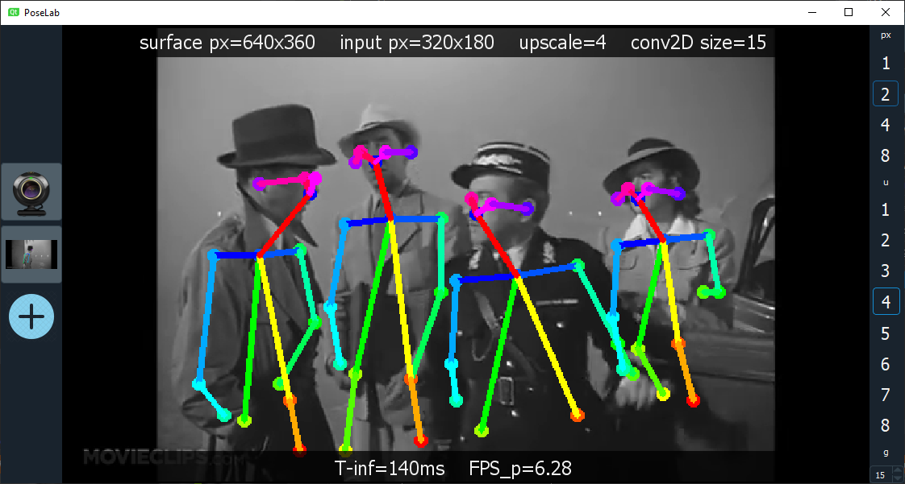
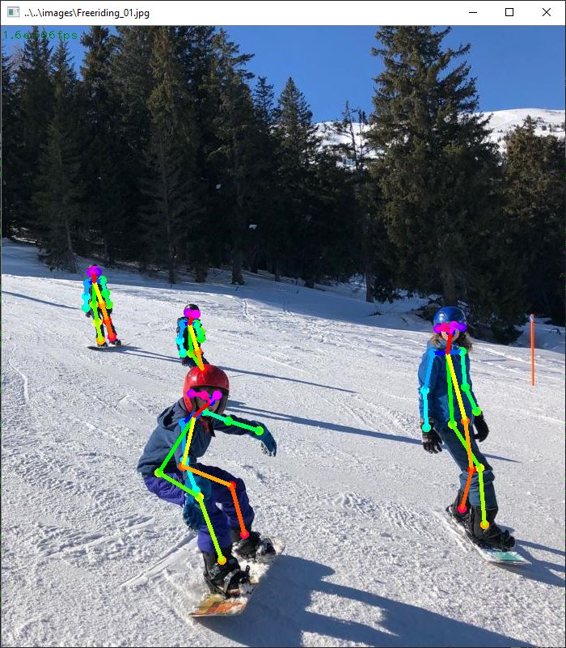

# PoseLab

Load your favorite movie clip or camera feed and play with the inference parameters to optimize fps & quality. Use the source bar on the right to select a video stream and adjust the inference parameters with the buttons on the right.

Tinf shows the inference duration, FPSp the complete roundtrip time for each frame.

The app has been developed with Qt 5 and OpenCV on Visual Studio. To build it, 
+ clone [this repository](https://github.com/vishwaphansal7/tf-cpp-pose-detect)
+ grab the TensorFlow r1.10 binaries from [here](https://github.com//lib/releases)
+ clone the [lib project](https://github.com/jenshemprich/lib/)
+ copy the tensorflow folder into the lib folder
+ download OpenCV 4.1.0 and drop it into the lib dir as well (you have to name it opencv-4.1.0)
+ install Qt 5.13.0 into the lib folder to lib/Qt/
+ Build with Visual Studio 2019

# TensorFlow based Human Pose Estimation in C++
This project demonstrates usage of the TensorFlow C++ interface for pose estimation.

## Dependencies
External libraries are referenced by msbuild targets within the lib project at https://github.com/jenshemprich/lib in order to link against the right library versions for each build configuration and to setup the executable path for running and debugging.

### Download 3rd-party libraries

+ Clone the lib repository into the same folder as this project.
+ Download and copy OpenCV-Release to the OpenCV-4.0.1 directory within the Lib folder.
+ Follow the instructions to build AVX/AVX2/CUDA versions of the TensorFlow library for Windows.
It takes a few hours to build each configuration - about half a day or so for all, so plan ahead.

### Download the inference models
For the time being, I'm using existing models (mobilenet_thin, cmu) from [here](https://github.com/ildoonet/tf-pose-estimation/tree/master/models/graph). Follow the instructions there to download them and place them in the models folder.

### Build the project
Open the Visual Studio solution file and rebuild all.

## How does it work
An in-depth article about the underlying algorithm can be found [here](https://arvrjourney.com/human-pose-estimation-using-openpose-with-tensorflow-part-2-e78ab9104fc8). With that knowledge, you can easily follow the code in PoseEstimator.cpp. It's a three-step process consisting of:
1. Inference to retrieve heat maps and part affinity fields.
2. Post-processing to retrieve coordinate candidates
3. Coco model creation from the coordinate candidates by reducing candidates, turn them into body part lists and output a coco model for each recognized pose.

Inference uses the same model, so it's exactly the same, but the post-processing implementation is slightly different from the Python code. In Python you pass operators as parameters to session.run(). In the TensorFlow C++ interface you have to define them in a separate graph, and then merge it with the inference graph. The session can then be created from a single graph that contains all operators.

I've got some trouble with using the inference output as a direct input for the post procesisng, because my TensorFlow build crashed on me when assigning a named node from the inference graph as an input for the slice operator.

For the time being, that issue is worked around by assigning the inference output to an intermediate add op, or alternatively by splitting up the processing into 2 session runs (one for inference, one for post-processing). The issue is isolated in a couple of unit tests, to look into it later on.

The TensorFlow-related part of the post-processing was relatively straightforward, the most time consuming part was to create the gaussian kernel for the convolution filter with Eigen instead of Numpy.

Because the C++ ops::where() operator outputs coordinates directly instead of producing another NHWC tensor (as the Python op tf.where does), the coco model creation becomes slightly less complex than in the original code. Besides some refactoring to turn the original Python extension code into a C++ class, the outer loops to gather the peak infos from the coordinates tensor have been replaced by a sort statement to get the coordinates into the right order - the subsequent stages of the algorithm assume a distinct sequence of coco parts.
